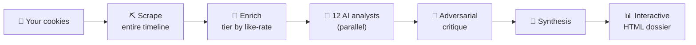

<div align="center">

# ⛏️ TwitterPersonalityScraper

### *Steal the strategies behind any X creator.*

**Scrape their whole timeline → run 12 AI analysts over it → walk away with their playbook.**


</div>

> Every top creator is running a **playbook**.
> Most of you are still out here *guessing* what it is.

Point this at any public X account. It logs in as **you** (your own cookies), scrolls their
**entire reachable timeline** — tweets, replies, quote tweets, the works — and hands it to a
swarm of **12 Opus AI analysts** who tear it apart from twelve different angles. Out the other
side: an **interactive HTML dossier** that reverse-engineers exactly how they win.



---

## 🎯 What you actually walk away with

| | |
|---|---|
| 🎣 **The Hook Templates** | the exact sentence structures behind their bangers |
| 🥷 **The Stealth-Promo Funnel** | how they sell hard without *ever* sounding like they're selling |
| 🕸️ **The Orbit** | who they're really in business with — the alliances & amplification loops |
| ⚖️ **Reach vs Resonance** | what the algorithm *spread* vs what people actually *loved* |
| 🎙️ **The Voice** | captured precisely enough to write in it |
| 🩻 **The Blind Spots** | where they're leaving reach (and money) on the table |

---

## 🧠 12 AI minds. Zero secrets left.

They read the whole timeline in **parallel**, each one wearing a different hat, then *argue* —
an adversarial critic fact-checks every claim before a final pass synthesizes them into one model.

| | Persona | The angle they work |
|---|---|---|
| 🖋️ | **Copywriter** | the hook, rhythm & CTA template behind every banger |
| 📈 | **Growth Marketer** | the funnel: attention → action → revenue |
| 🔥 | **Tribal Anthropologist** | the in-group codes, shared enemies & status games |
| 🧠 | **Psychologist** | what drives them, what they fear, what the posting feeds |
| 🎣 | **Persuasion Engineer** | every Cialdini lever they pull — proof, scarcity, authority… |
| 🕸️ | **Network Strategist** | the alliances & amplification loops they ride |
| 🏷️ | **Brand Strategist** | the one thing they're *"the person who…"* |
| 📐 | **Quant** | what the numbers prove — and quietly debunk |
| 🚨 | **Red-Team Skeptic** | the cope, the contradictions, the parts they're faking |
| 🌊 | **Cultural Critic** | how they surf the trend *before* it's a trend |
| 😂 | **Vibe Analyst** | the humor, the bit, why it's so easy to root for them |
| 🎙️ | **Voice Cloner** | their idiolect, captured well enough to write *as* them |

---

## 🚀 Quickstart

```bash
# 0 — install
pnpm install
pnpm exec playwright install --with-deps chromium

# 1 — drop in your cookies (DevTools → Application → Cookies on x.com)
cp auth/cookies.example.json auth/cookies.json     # paste auth_token + ct0

# 2 — grab the timeline   (bare handle, @handle, or full URL)
pnpm scrape <handle>

# 3 — tier it by what actually resonated
pnpm enrich <handle>

# 4 — unleash the analysts
#     just tell your Claude Code session:  "analyze <handle>"
```

<sub>Steps 0–3 are plain TypeScript. Step 4 is a Claude Code session following <code>ANALYSIS_USAGE.md</code> and running the multi-agent workflow — no extra setup.</sub>

---

## 🤖 Built for Claude Code

Drop a Claude Code session into this repo and **it routes itself** — [`CLAUDE.md`](./CLAUDE.md) tells it:

- *"scrape `<handle>`"* → reads [`SCRAPE_USAGE.md`](./SCRAPE_USAGE.md)
- *"analyze `<handle>`"* → reads [`ANALYSIS_USAGE.md`](./ANALYSIS_USAGE.md) → fans out the 12 analysts → writes the dossier

You don't even need to know how it works. You just *ask*.

---

## 📦 What the scraper pulls

```ts
{
  id, url, text, createdAt,
  author: { handle, name },
  isReply, isRepost, isQuote,
  quoted: { handle, name, text } | null,   // QRTs come with the quoted tweet embedded
  replyingTo: string[],                     // replies come with who they're aimed at
  replies, reposts, likes, views,           // exact integers — not the rounded "1.2K"
  scrapedAt
}
```

---

<div align="center">

**The creators you follow aren't gatekeeping magic. They're running patterns.**

**Go find the patterns. — thank me later.** 🫡

</div>
